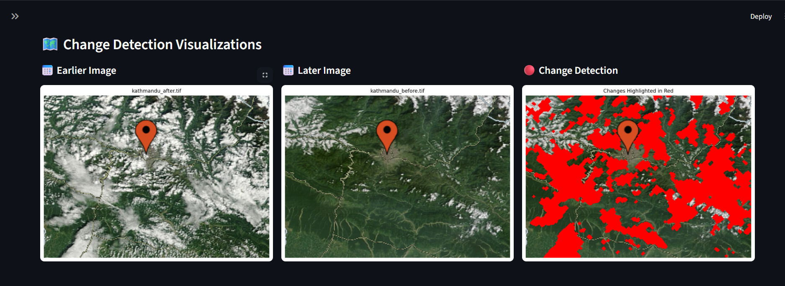
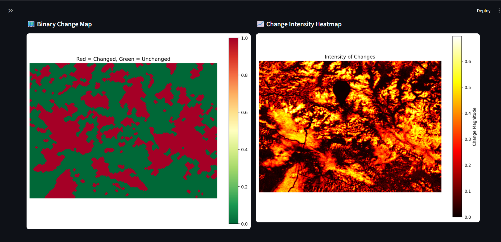

# 🛰️ Satellite Image Change Detection System

A Business Intelligence dashboard and Python toolkit for analyzing temporal changes in satellite imagery. Detect changes, visualize results, and generate AI-powered natural language insights for environmental monitoring, urban planning, disaster assessment, and more.

## 📋 Overview

This system detects and visualizes changes between two time periods using GeoTIFF satellite images. It includes:

- An interactive Streamlit dashboard for analysis and reporting
- Multiple change detection algorithms (Threshold, Otsu, CVD, NDVI)
- KPIs, charts, and export options
- Optional AI summaries powered by Google Gemini

## ✨ Key Features

### 🔍 Change Detection Algorithms
- Threshold-based detection (configurable sensitivity)
- Otsu auto-thresholding (automatic optimal threshold)
- Change Vector Detection (CVD) across multi-spectral bands
- Vegetation Analysis (NDVI) for vegetation loss/gain

### 📊 Dashboard & BI
- Upload or pick sample images, compare earlier vs later images
- Side-by-side image comparison, change overlays, and heatmaps
- KPIs: change %, regions, average region size, and more
- Export change maps and statistics as CSV

### 🤖 AI-Powered Insights (Optional)
- Natural language summaries of results using Google Gemini
- Auto-enabled when GEMINI_API_KEY is set in .env

## �️ Screenshots





## �📁 Project Structure

```
Satelite_Image_detection/
├── app.py               # Streamlit dashboard (main UI)
├── change_detector.py   # Core detection algorithms
├── ai_summarizer.py     # AI summary generation (Gemini)
├── example_usage.py     # Script usage example
├── requirements.txt     # Python dependencies
├── README.md            # This file
├── sample_images/       # Example GeoTIFFs for quick testing
└── archive/             # Onera dataset (optional, large)
```

## �️ System Requirements

- Python 3.8+
- OS: Windows 10/11, macOS, or Linux
- RAM: 4GB minimum (8GB+ recommended for large images)

## 🚀 Quick Start

### 1) Create a virtual environment

```bash
python -m venv .venv
# On Windows (Git Bash):
source .venv/Scripts/activate
# On macOS/Linux:
source .venv/bin/activate
```

### 2) Install dependencies

```bash
pip install -r requirements.txt
```

If you hit issues installing rasterio/GDAL on Windows, consider using conda:

```bash
conda create -n satimg python=3.10 -y
conda activate satimg
conda install -c conda-forge rasterio gdal -y
pip install -r requirements.txt
```

### 3) (Optional) Enable AI summaries

Create a .env file in the project root with your Google AI Studio key:

```env
GEMINI_API_KEY=your_key_here
```

Alternatively, paste the key in the dashboard sidebar at runtime.

### 4) Run the dashboard

```bash
streamlit run app.py
```

The app will open at http://localhost:8501.

## 💻 How to Use

### Via Dashboard (Recommended)
1. Load images: Upload GeoTIFFs (.tif/.tiff) or select from sample_images/
2. Pick “Earlier” and “Later” images
3. Choose a detection method and adjust parameters
4. Click “Run Analysis” to compute results
5. Explore Analysis, Image Gallery, and Statistics tabs
6. Download CSV exports for change maps and metrics
7. (Optional) Enable AI Summary for a plain-English insight

### Via Python Script

```python
from change_detector import ChangeDetector

detector = ChangeDetector(
      "sample_images/kathmandu_before.tif",
      "sample_images/kathmandu_after.tif"
)

detector.load_images()
change_map = detector.detect_changes_threshold(threshold=0.15)
stats = detector.analyze_change_statistics(change_map)

print(f"Changed pixels: {stats['changed_pixels']:,}")
print(f"Change percentage: {stats['change_percentage']:.2f}%")
```

## 🔬 Algorithms (Brief)

- Threshold-based: absolute pixel difference > threshold
- Otsu: automatic threshold from image histogram
- CVD: magnitude of multi-band change vector
- NDVI: vegetation index Delta for gain/loss classification

## � Supported Data

- GeoTIFF (.tif, .tiff)
- Single or multi-band satellite imagery (e.g., Landsat, Sentinel)

## 📈 Performance Tips

- Large images require more RAM and processing time
- Multi-band analyses (CVD, NDVI) are heavier than single-band thresholds
- Heatmaps and overlays may be slow for very large rasters

## 🧰 Troubleshooting

- rasterio install fails on Windows
   - Prefer conda: `conda install -c conda-forge rasterio gdal`
- No images loaded / button disabled
   - Ensure at least two .tif/.tiff files are loaded and selected as different images
- AI summary not working
   - Provide a valid GEMINI_API_KEY in .env or the sidebar. Requires internet access.

## 🤝 Contributing

1. Fork the repo
2. Create a feature branch
3. Make changes with tests where applicable
4. Open a Pull Request

## 📄 License

MIT License. See LICENSE if provided in the repository.

---

Turning satellite data into actionable insights. 🛰️
